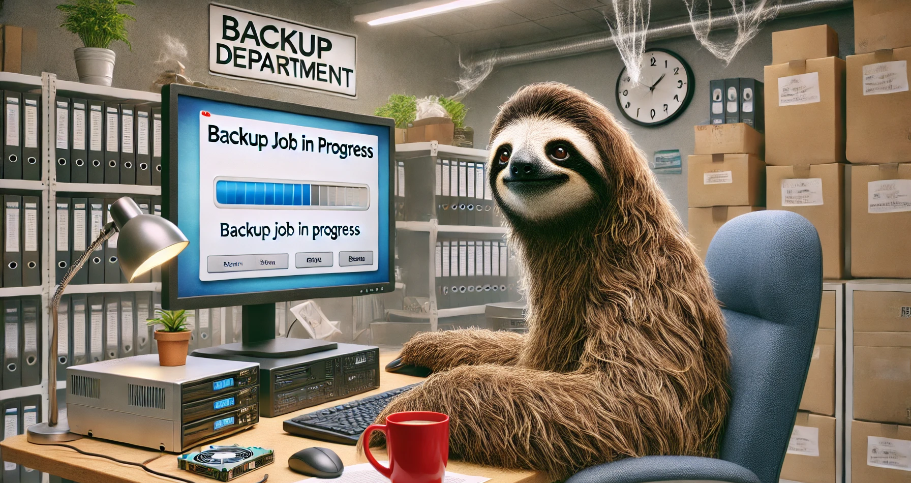
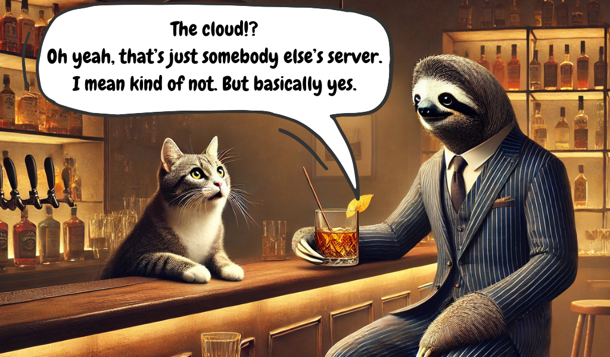
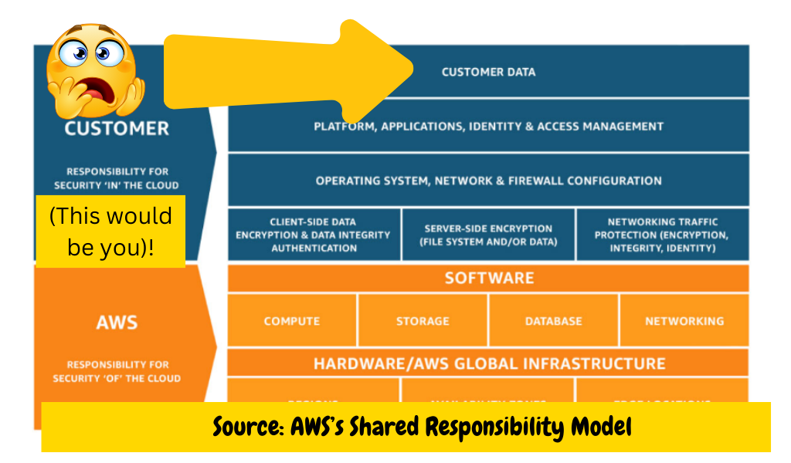
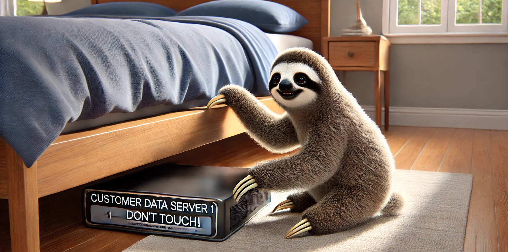
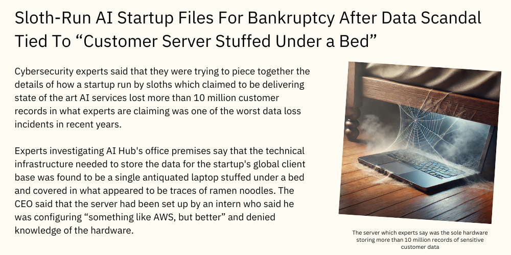

# Why I Refuse To Stop Caring About Backup Stuff

Yes, dear person on Github, I know what you're thinking (at least I think I do):

**This is a safe refuge from clickbait.**

Also: that's one of the strangest and most melodramatic headlines I've seen this five minutes.

Also: is that a sloth running a backup job!? 

(Why yes, yes it is. Thank you, DALLE!)

Anyway.

If I'm creating a small repository of my most hot-button thoughts on technology subjects, it would be totally remiss of me to skip the one subject that's likely to draw yawns even from devoted tech enthusiasts. That would be... backups.

There's something vaguely shameful about caring about backups, I think. Prepping has the same baggage. Did I mention that I'm also a prepper? Backup anoraks are the preppers of the digital world. Sometimes, they're awful enough to be both at the same time. My apartment is littered with both cans of tuna *and* spare hard drives (not really. Please visit. But preferably if I know you).

I have appeared as a guest (twice!) on the world's first and (as far as I know) only backup podcast. It's now called [The Backup Wrapup](https://podcasts.apple.com/us/podcast/the-backup-wrap-up/id1469663053) and it's hosted by the dynamic duo of W. Curtis Preston (AKA "Mr. Backup") and Prasana Malaiyandi, whose name is far harder to remember to type correctly (and I'm writing this *sans* spell-check in markdown!)
 
I'll try to make this quick. It will be rant-link. Or just a rant. 

You were warned. 

## The Cloud Is Not Backup!

Cloud vendors would like you to think that "the cloud" is syonymous backup.

Unfortunately, this well-worn aphorism is pretty much on point:

But the dismissive attitude that *many* SaaS companies take to the subject of how consumers can use their clouds while also ensuring some kind of (managed) backup runs a bit deeper than hubris that anything stored on S3 (etc) is essentially indestructible. 

Many consumers - including highly technically-literate ones - are blisfully unaware of the fact that in many cloud computing contracts, vendors explicitly disclaim any responsibility from securing the integrity of your data (I don't mean this condescendingly; most normal people just aren't anxious enough to wonder about this stuff).

Stories to reaffirm the point that the cloud isn't backup actually abound, ranging from the occasional high profile incident in which a SaaS provider screws something up and loses customer data. To more pedestrian incidents such as those I've personally witnessed in which somebody accidentally deletes a shared Google Drive (then empties the bin) accidentally erasing hundreds of thousands of dollars worth of IP in a few keystrokes (I promise it wasn't me!)

*"But there's still a way to get that back, right?*"" No!

*I mean, we pay Google so there's gotta be somebody who can help?"*"

Perhaps if you pay them millions of dollars. 

But sorry, Joe. 

In the big scheme of things, you're just one of millions of small fry Workspace customers like me. Your dedicated account manager is the support desk site (like the page, not a person). 

Or a chatbot. We don't care. Nobody cares about your data, Joe. It's gone. Maybe you should have taken a backup after all!

## But Wait, SaaS Does Backup?! RIGHT!?

But wait ... what about Google Takeout?

At the time of writing, from a pure backup standpoint, Takeout is so primitive that to call it a "backup" utility is arguably not even accurate. 

It's a kind of functional data export tool to mop some of your data up from Google's sprawling ecosystem. If it were a backup tool, it would be a full one and a highly inefficient and antiquated way to move data from cloud to premises. 

Incremental backup was invented in the 1960s. "Incremental" means that you only pull down the changes in the filesystem. Takeout isn't incremental. It's not automatable. 

Nobody wants to interrupt their vacation to manually initiate a Google Takeout. Then wait for the email to arrive saying it's ready. Then queue up the multipart download because the only way you can extract a large heap of data is through batching it into a bunch of small chunks. Then get those into a folder. Then upload or store them. 

Seriously. Even I can't be bothered, and that's saying quite a lot (an entire shelf of my not generously sized wardrobe is dedicated to storing optical media that looks like it was pulled straight out of the 90s ... which is may have been). 

From a backup standpoint, Takeout is about as useful as an LTO tape after you pulled all the tape out and made confetti out of it. 

## Enterprise SaaS backup is not totally derelict

As is often the case, the situation in the world of enterprise tech is a bit better. 

This isn't surprising. People like government agencies, national security organisations (you know, like, spies), and those who have to comply with things like HIPAA standards are often legally prohibited from storing a bunch of data on a random SaaS tool that they hope is competent at storing their data securely. 

Informed sources tell me that this sometimes mean that they use technology that would actually feel totally retro if wheeled out in your average normal tech-embracing organisation. On-premises and hybid implementations are still things and mainframes are not dead. When the Iranian state had some sketchy stuff to hide, they chose (apparently) to go old-school and write it onto CD-ROMs.

## All Is Not Entirely Bleak. But In Consumer SaaS, It Pretty Much Is. Sorry. 

Progress has been made over the years by innovative tools trying to use API integrations to help consumers mop up *some* of their data. 

The fact that it has usually taken third parties to bring this tech to market, however, speaks volumes about the fact that most SaaS companies simply don't care. 

GDPR exports are typically only about as useful as export utilities. Both are better understood as begrudgingly-enabled features that are offered because a regulator said that they have to. Nobody who cares about backups would architect a backup feature like this. A slim minority of tools offer users access to APIs that **shock, horror, yes, it's possible!** allow users the vaunted ability to, you know, actually grab a copy of **their own data** and put it **somewhere that they own or can control**. 

Minus that assurance, most of us are left hoping that the fancy text in the footer which reassures us that the SaaS vendor is taking their own backups is really true (ask the same vendor if you can access those backups and the situation might start to seem less rosey).

Part of the explanation for which self-hosting continues to be a vibrant part of the tech world when so much SaaS abounds (and I think this point is rarely made!) is that many, like the dear author, simply don't feel confident using a CRM (or a wiki) on storage they cannot control.

## Towards a shared federacy model to end (self-imposed) consumer SaaS feudalism

The prevalent governance model through which SaaS is delivered today could be (perhaps too charitably) described as a kind of digital form of feudalism.

In exchange for metered access to pair services from benevolently disposed cloud providers, SaaS customers unwittingly agree to forfeit any control or right over meangingful access to their own data. 

This status quo doesn't exist because SaaS providers are unable to provision the tools that would allow consumers to co-own the data (setting up an integration with an external database or object storage bucket isn't hard). The status quo exists because until SaaS consumers question the inadequacy of this model the situation will persist. 

SaaS companies derive the majority of their business revenue (in many cases) not from privacy-conservative cranks like me. But rather from large enterprise clients who typically avoid consumer-grade SaaS over well-founded data governance concerns. 

## A minimum standard for consumer SaaS backup

So what kind of future would I like to see for SaaS backup?

Firstly, not all data needs to be meticulously preserved. But it's reasonable for consumers to expect that they should retain shared ownership over at least *some* of their data. 

Emails held in webmail clients might contain treasured personal correspondence. 

Customers frequently use tools like calendars and task managers tools and cloud document tools. Small business uses all of these things too in addition to tools like project management software, wiki software, etc. 

The cloud is great and convenient. And with a smattering of encryption, I'd probably be happy to never self-host applications again. But until SaaS providers can understand that data governance is not a black and white paradigm, little will change. 

The idea that consumers have no expectation to direct access to data they own - or that the only direct access they should get to data is in formats that aren't portable or useful - is antiquated. Not just for "valuable" enteprise data. But for everybody's data. 

Thank you for sticking to the end. 
